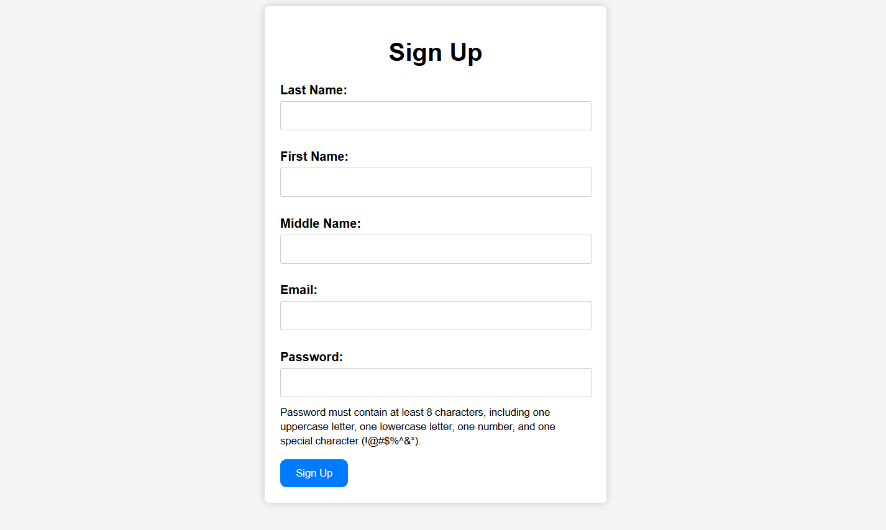
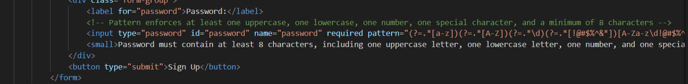
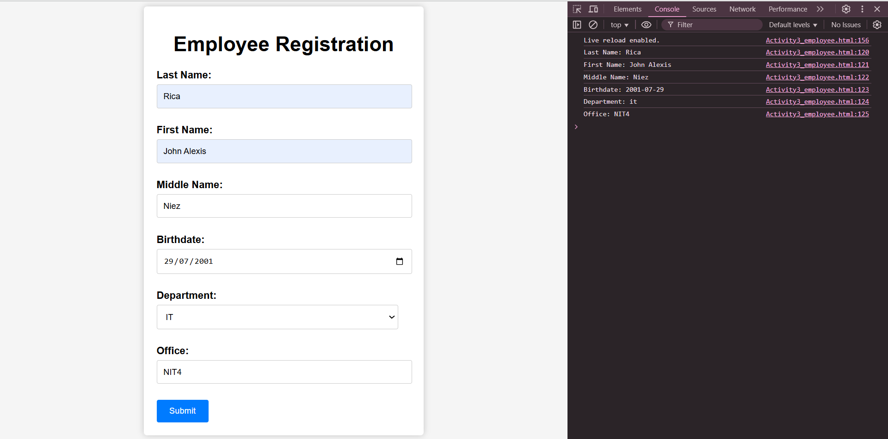
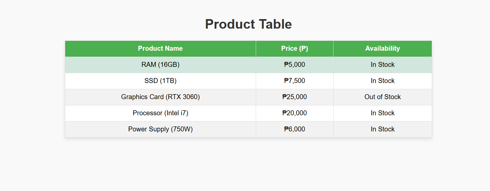
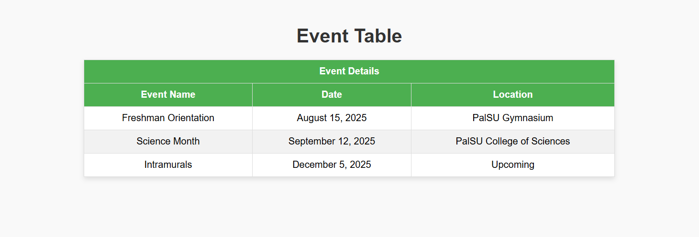

# Rica-Gaite
This Repository consist of two Activity, every activity have its own instruction that we need to do (Below is some of the Answer)

# Introduction Activity

## Pirates of the Caribbean: A Swashbuckling Adventure

## Overview
This project is a simple HTML webpage that provides an overview of the *Pirates of the Caribbean* film series. It includes details about the main characters, plot, setting, and personal thoughts on the franchise.

## Features
- Introduction to *Pirates of the Caribbean* series
- Description of main characters
- Summary of the film's plot and setting
- Personal thoughts and reasons to watch the series
- Activity sections displaying ordered and unordered lists
- Inspirational quotes from famous philosophers
- Image inclusion of Filipinos in traditional dress
- Explanation of HTML tags used in the document
- Internal links and navigation information
- Footer section with contact details

# Intermediate Activity
Creating forms and making Tables

## Screen Captures of the Answer  
  
### Activity #1 Answer 

 
  
### Activity #2 Answer

 
  
### Activity #3 Answer

  
  
### Activity #4 Answer

  
  
### Activity #5 Answer

## Authors
### Name: *John Alexis Rica*  
### Email: *202080107@psu.palawan.edu.ph*  
### Name: *John Cris Gaite*
### Email: *201720022@psu.palawan.edu.ph*

Feel free to explore and contribute to the project!

